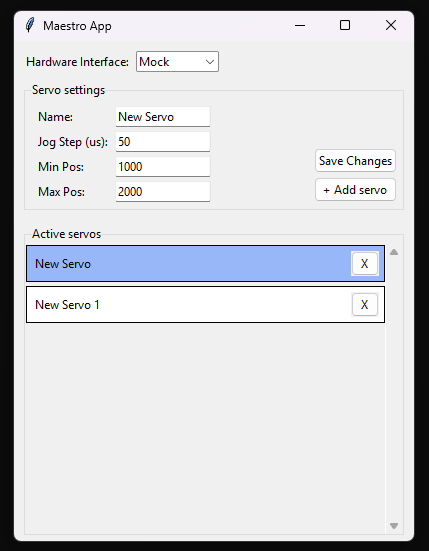
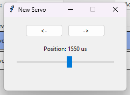
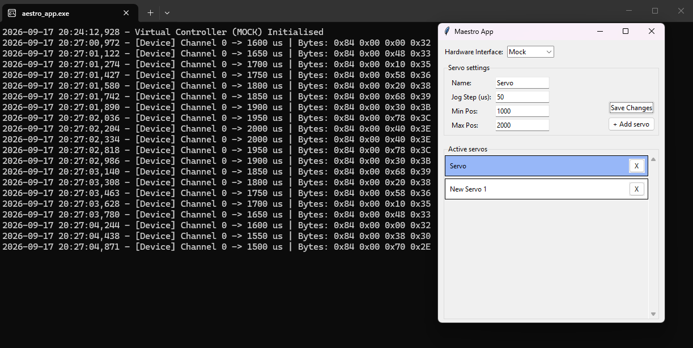

# Dokumentacja Techniczna - Sterownik Serw Maestro

## 1. Wprowadzenie i Cel Projektu
Projekt to aplikacja stworzona w języku Python, przeznaczona do sterowania i konfiguracji serw z użyciem kontrolera Pololu Maestro. Została zaprojektowana na potrzeby procesu rekrutacyjnego dla firmy EG EXTENSA.

Aplikacja umożliwia:
- Dynamiczne dodawanie, usuwanie i edycję konfiguracji maksymalnie do 24 kanałów serw.
- Konfigurację parametrów dla każdego serwa z osobna (Nazwa, Jog Step, Limity Min/Max).
- Sterowanie serwami za pomocą wyskakujących okienek.
- Zapis stworzonych profili serw do pliku JSON (`servos_config.json`).
- Testowanie bez podłączenia fizycznego sprzętu w trybie **Mock**.

---

## 2. Architektura Systemu (Separacja Warstw)
Aplikacja została podzielona na trzy niezależne warstwy w celu zapewnienia skalowalności oraz elastyczności:

### A. Warstwa Sprzętowa (`hardware.py`)
- **Interfejs bazowy (`MaestroInterface`)**: Definiuje jednolity kontrakt dla wszystkich kontrolerów (metody `set_target` oraz `close`).
- **Implementacja Rzeczywista (`SerialMaestroController`)**: Odpowiada za fizyczną komunikację przez port szeregowy COM z wykorzystaniem biblioteki `pyserial`. Formatuje polecenia według standardu *Compact Protocol* (ramka 4-bajtowa: komenda `0x84`, kanał, młodsze i starsze bity pozycji).
- **Implementacja Wirtualna (`MockMaestroController`)**: Logująca operacje do standardowego wyjścia (konsoli) w formacie szesnastkowym (Hex), co umożliwia weryfikację poprawności ramek bez fizycznego sprzętu.

### B. Warstwa Domenowa (`domain.py`)
- **Model `Servo`**: Reprezentuje stan i konfigurację pojedynczego serwa(kanał, nazwa, aktualna pozycja, krok, limity).
- **Menedżer `ServoManager`**: Zarządza alokacją wolnych kanałów, obsługą stanu kolekcji serw oraz trwałością danych (`_save_config` / `_load_config`).

### C. Warstwa Widoku / Interfejs Użytkownika (`maestro_app.py`)
- **`MainWindow`**: Okno główne pełniące funkcję menedżera właściwości. Obsługuje listę przewijalną aktywnych serw, dodawanie, edycję szablonów oraz podświetlanie wybranego elementu.
- **`ServoWindow`**: Niezależne, podrzędne okienka dla każdego serwa. Odpowiadają za regulację pozycji suwakiem oraz przyciskami (`<-`, `->`).

### Konfiguracja
- Dodatkowo zmienne odpowiadające za np. parametry GUI, czy domyślną konfigurację znajdują się w osobnym pliku (`config.py`)

---

## 3. Schemat Pliku Konfiguracyjnego (JSON)
Aplikacja przechowuje stan oraz ustawienia interfejsu w jednym pliku konfiguracyjnym, zachowując poniższą strukturę:
```json
{
    "settings": {
        "hw_mode": "Mock"
    },
    "servos": {
        "0": {
            "name": "Servo 0",
            "position": 1500,
            "step": 50,
            "min_val": 1000,
            "max_val": 2000
        }
    }
}
```

## 4. Instrukcja Obsługi i Interfejs Użytkownika

### Okno Główne (Master)


*   **Hardware Interface:** Pozwala na przełączanie między fizycznym portem (Serial) a symulatorem (Mock).
*   **Servo settings:** Formularz edycji. Kliknięcie wiersza na liście ładuje jego dane. Próba zapisania błędnych danych (np. Min > Max) jest blokowana przez system walidacji.
*   **Active servos:** Lista dodanych urządzeń. Przewijana kółkiem myszy. **Pojedyncze kliknięcie** ładuje wybrane serwo do edycji, **podwójne kliknięcie** otwiera panel sterowania serwem.

### Panel Sterowania Serwem (Detail)


*   Niezależne okno. Pozycja suwaka jest na bieżąco ograniczana przez zmienne `Min Pos` i `Max Pos`. 
*   Przyciski `<-` oraz `->` pozwalają na skok o wartość zadeklarowaną w `Jog Step`.

### Symulacja Sprzętowa (Mock Terminal)


*   Przy ustawieniu trybu `Mock`, aplikacja nie generuje błędów braku połączenia COM. Zamiast tego, każdy ruch suwaka formatuje 4-bajtową ramkę Pololu i wypisuje ją do terminala (np. `0x84 0x00 0x70 0x2E`). Pozwala to na weryfikację protokołu komunikacyjnego bez sprzętu.

## 5. Instrukcja Uruchomienia i Kompilacji

### Wymagania wstępne:
- Python w wersji 3.10 lub nowszej.

### 1. Uruchomienie ze źródła:
```bash
# Sklonuj/otwórz folder projektu i aktywuj środowisko wirtualne
python -m venv venv
# Windows:
.\venv\Scripts\activate

# Zainstaluj wymagane zależności
pip install -r requirements.txt

# Uruchom aplikację
python maestro_app.py
```

### 2. Generowanie samodzielnego pliku `.exe`:
```bash
# W aktywnym środowisku wirtualnym wykonaj:
pyinstaller --onefile maestro_app.py
```
Plik wykonywalny zostanie wygenerowany w katalogu `dist/maestro_app.exe`. Konsola systemowa pozostaje widoczna celowo, aby umożliwić monitorowanie przechwytywanych ramek sprzętowych.

---